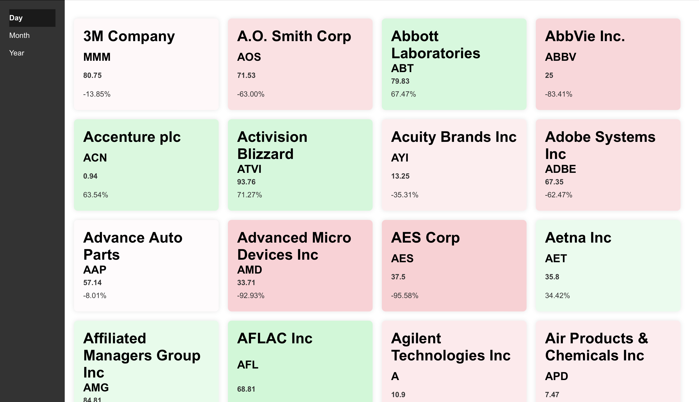

Demo Project
- backend service responsible for fetching data from yahoo finance and store it on a postgres db
- backend service that provide information to a react app with current stock information on the system
- frontend react app show current stock information to the user

Screenshot:


Backend App:
 - Java v22
 - Spring Boot v3.3
```
./gradlew clean build
```
Url: http://localhost:8080/api/stocks

Frontend:
- React v18
- Node v20
```
cd frontend
npm run build && npm start
```

Launch Docker:
```
docker-compose up --build
```
Url: http://localhost:3000
